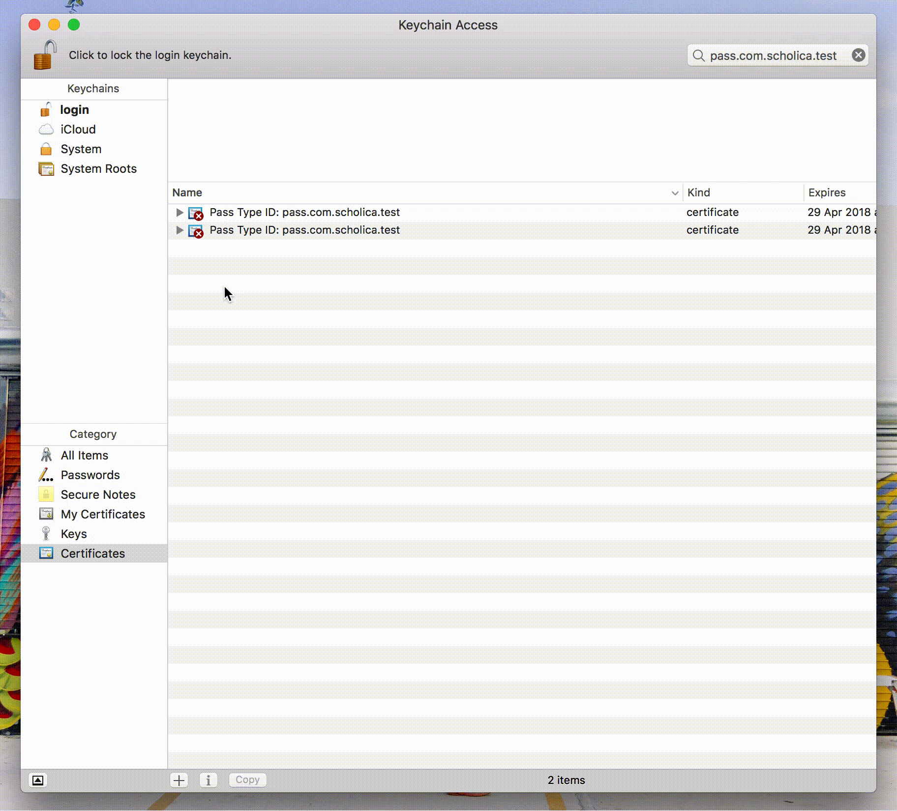
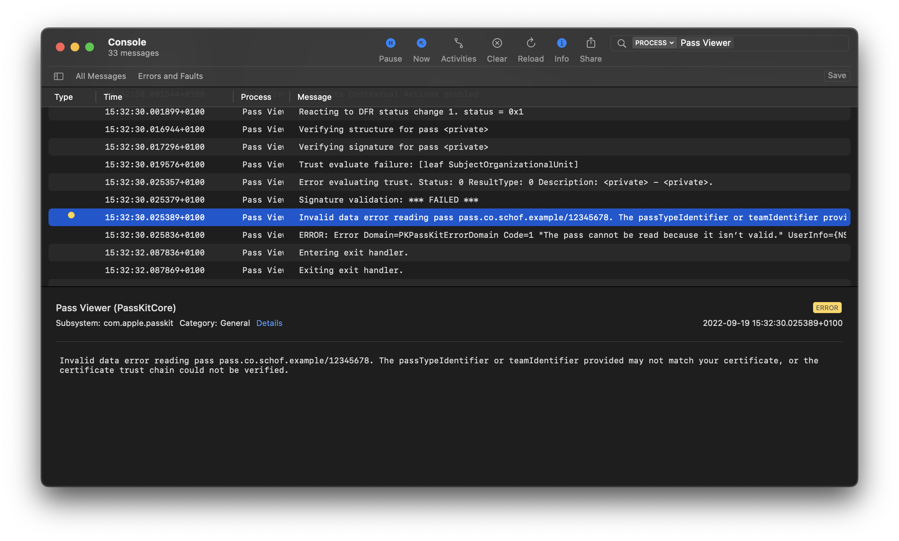

# PHP library to create passes for iOS Wallet

[](https://packagist.org/packages/pkpass/pkpass)
[](https://packagist.org/packages/pkpass/pkpass)
[](LICENSE)

This class provides the functionality to create passes for Wallet in Apple's iOS. It creates,
signs and packages the pass as a `.pkpass` file according to Apple's documentation.

## Requirements

* PHP 7.0 or higher (may also work with older versions)
* PHP [ZIP extension](http://php.net/manual/en/book.zip.php) (often installed by default)
* Access to filesystem to write temporary cache files

## Installation

Simply run the following command in your project's root directory to install via [Composer](https://getcomposer.org/):

```
composer require pkpass/pkpass
```

Or add to your composer.json: `"pkpass/pkpass": "^2.0.0"`

## Usage

Please take a look at the [examples/example.php](examples/example.php) file for example usage. For more info on the JSON for the pass and how to
style it, take a look at the [docs at developers.apple.com](https://developer.apple.com/library/ios/documentation/UserExperience/Reference/PassKit_Bundle/Chapters/Introduction.html).

## Included demos

* 📦 [Simple example](examples/example.php)
* ✈️ [Flight ticket example](examples/full_sample/)
* ☕️ [Starbucks card example](examples/starbucks_sample/)

## Functions to add files

* `addFile` : add a file without locale like `icon.png`
* `addRemoteFile` : add a file from a url without locale like `https://xyz.io/icon.png`
* `addLocaleFile` : add a localized file like `strip.png`
* `addLocaleRemoteFile` : add a localized file from a url like `https://xyz.io/strip.png`


### Requesting the Pass Certificate

1. Go to the [iOS Provisioning portal](https://developer.apple.com/account/ios/identifier/passTypeId).
2. Create a new Pass Type ID, and write down the Pass ID you choose, you'll need it later.
3. Click the edit button under your newly created Pass Type ID and generate a certificate according to the instructions
   shown on the page. Make sure *not* to choose a name for the Certificate but keep it empty instead.
4. Download the .cer file and drag it into Keychain Access.
5. Find the certificate you just imported and click the triangle on the left to reveal the private key.
6. Select both the certificate and the private key it, then right-click the certificate in Keychain Access and
   choose `Export 2 items…`.
6. Choose a password and export the file to a folder.



### Getting the example.php sample to work

1. Request the Pass certificate (`.p12`) as described above and upload it to your server.
2. Set the correct path and password on [line 22](examples/example.php#L22).
3. Change the `passTypeIdentifier` and `teamIndentifier` to the correct values on lines [29](examples/example.php#L29)
   and [31](examples/example.php#L31) (`teamIndentifier` can be found on
   the [Developer Portal](https://developer.apple.com/account/#/membership)).

After completing these steps, you should be ready to go. Upload all the files to your server and navigate to the address
of the examples/example.php file on your iPhone.

## Debugging passes

If you aren't able to open your pass on an iPhone, plug the iPhone into a Mac and open the 'Console' application. On the
left, you can select your iPhone. You will then be able to inspect any errors that occur while adding the pass:



* `Trust evaluate failure: [leaf TemporalValidity]`: If you see this error, your pass was signed with an outdated
  certificate.
* `Trust evaluate failure: [leaf LeafMarkerOid]`: You did not leave the name of the certificate empty while creating it
  in the developer portal.

## Changelog

**Version 2.1.0 - April 2023**

* Add alternative method for extracting P12 contents to circumvent issues in recent versions of OpenSSL.

**Version 2.0.2 - October 2022**

* Switch to `ZipArchive::OVERWRITE` method of opening ZIP due to PHP 8 deprecation ([#120](https://github.com/includable/php-pkpass/pull/120)).

**Version 2.0.1 - October 2022**

* Update WWDR certificate to v6 ([#118](https://github.com/includable/php-pkpass/issues/118)).

**Version 2.0.0 - September 2022**

* Changed signature of constructor to take out third `$json` parameter.
* Remove deprecated `setJSON()` method.
* Removed `checkError()` and `getError()` methods in favor of exceptions.

## Support & documentation

Please read the instructions above and consult the [Wallet Documentation](https://developer.apple.com/wallet/) before
submitting tickets or requesting support. It might also be worth
to [check Stackoverflow](http://stackoverflow.com/search?q=%22PHP-PKPass%22), which contains quite a few questions about
this library.


<br /><br />

---

<div align="center">
	<b>
		<a href="https://includable.com/consultancy/?utm_source=includable/php-pkpass">Get professional support for this package →</a>
	</b>
	<br>
	<sub>
		Custom consulting sessions availabe for implementation support and feature development.
	</sub>
</div>
